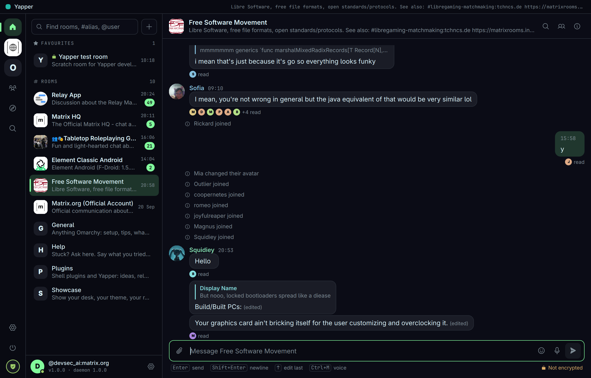
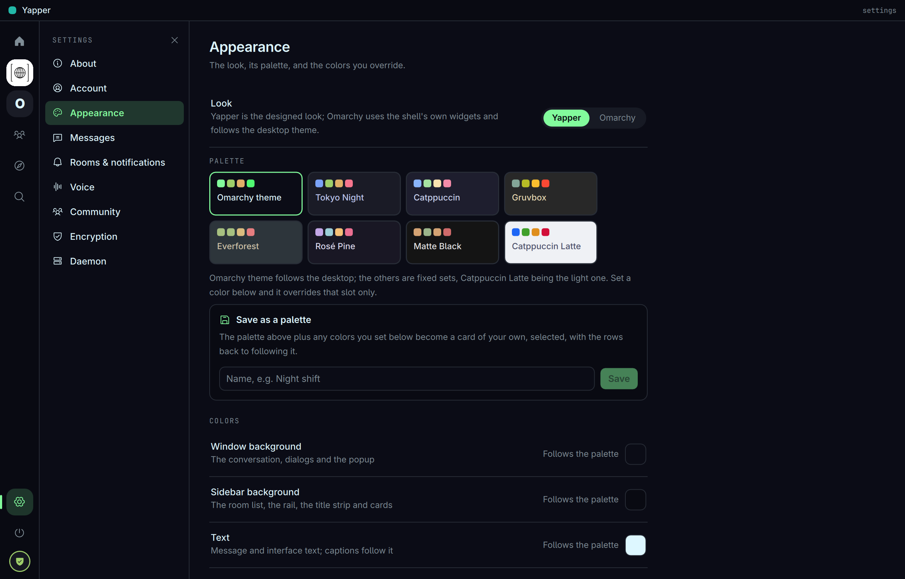
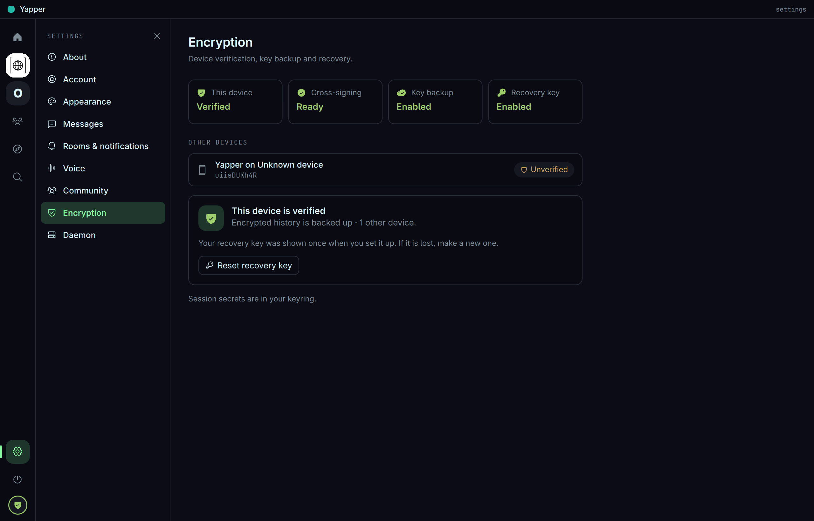
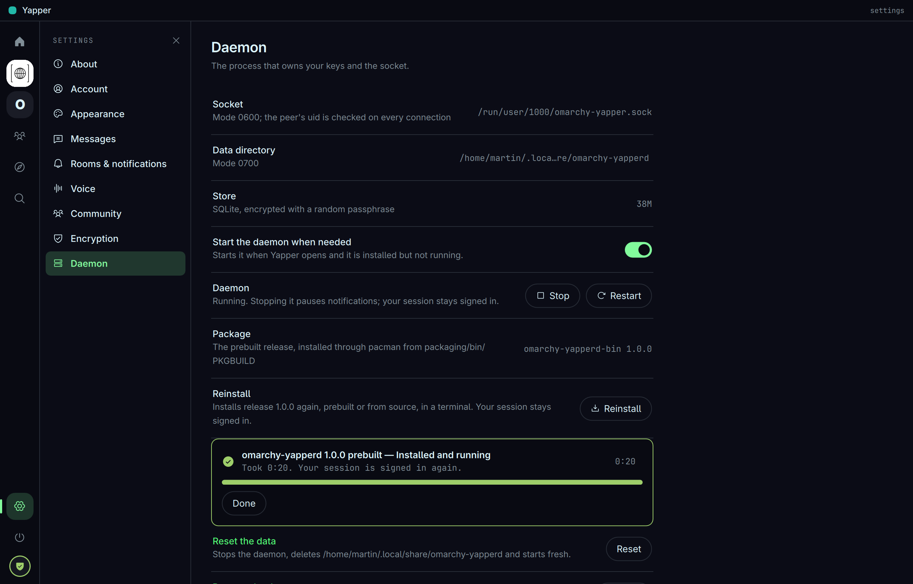
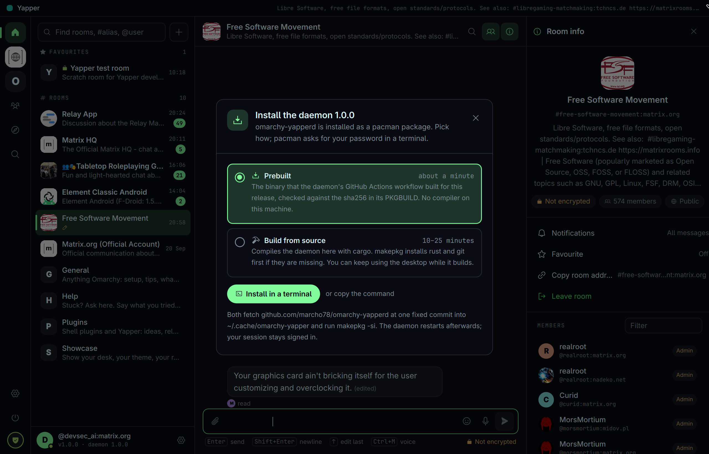
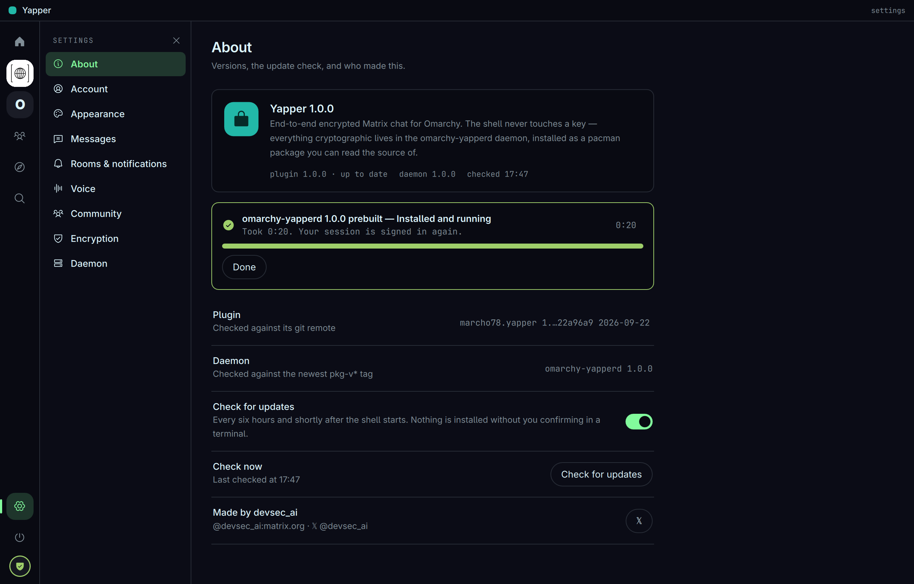
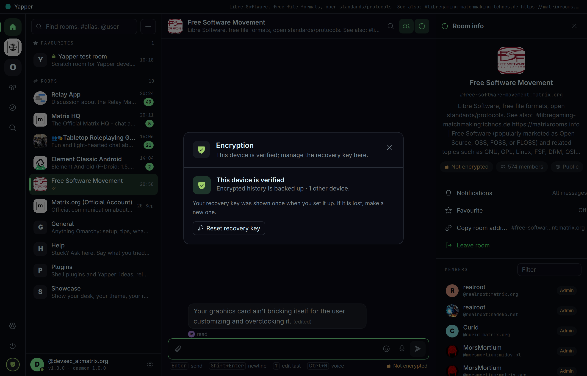

# Yapper


End-to-end encrypted chat, in the bar and as a window. It speaks Matrix, so
it talks to Element and everyone else on the network; encryption is
Olm/Megolm via matrix-rust-sdk, the same stack as Element X.

The plugin is QML only. Everything that touches keys or the network lives in
[omarchy-yapperd](https://github.com/marcho78/omarchy-yapperd), a small daemon
installed as a pacman package from its own repository: prebuilt by GitHub
Actions and checksummed, or compiled from source on your machine. **The
plugin itself downloads and executes nothing.**



## What you get

| In the bar | In the popup and the window |
|---|---|
| Yapper glyph with the unread count | Rooms with unread and highlight counts; encrypted rooms marked 󰌾, DMs 󰭹 |
| Left click opens the popup, middle click opens the window | **Find**: a word searches the public directory, `#alias:server` joins, `@user:server` opens a DM, `@name` finds people |
| Dimmed while signed out | **Room** creates one — end-to-end encrypted and private by default |
| Notifications for rooms no view is showing | Invitations with Accept / Decline; Leave room |
| | History back to the start of the room — scroll up or press *Load earlier*; live messages |
| | Multi-line composer: Enter sends, Shift+Enter (or Ctrl+Enter) starts a new line, grows to six lines then scrolls; unsent text is kept per room as a draft (shown 󰏫 in the room list) |
| | Images inline (click to open), files as cards with Open; send with 📎, drag-and-drop, or Ctrl+V an image — encrypted in encrypted rooms |
| | Voice messages: 󰍬 (or Ctrl+M) records from the microphone, Enter sends, Esc discards; sent as Opus with a waveform so Element shows them as voice notes; received ones play inline with a waveform scrubber |
| | Markdown in the composer (`**bold**`, `_italic_`, `` `code` ``, lists, quotes); `:tada` offers emoji, Tab or Enter inserts; 󰞅 opens Omarchy's emoji picker |
| | The first link in a message gets a preview card — title, description and image, fetched by your homeserver |
| | Replies, edits (Up edits your last message), reactions, read receipts, typing indicators; room info with members, invites and moderation |
| | Threads: 󰻞 on any message starts one; roots show "N replies · who · when"; the thread opens beside the conversation (or in its place when narrow, and in the popup) with its own composer; thread replies stay out of the room timeline |
| | Spaces, favourites, search across rooms and messages, per-room notification levels |
| | Bridged rooms (WhatsApp, Telegram, Signal, Discord… via a bridge on your homeserver or Beeper) show the network's logo, "via WhatsApp", who the bridge bot is, and say plainly that encryption stops at the bridge; bridged senders are tagged by name |
| | **Explore**: the globe with an empty Find field lists your homeserver's public directory, most-joined first, with Load more; typing narrows it |
| | **Omarchy community**: a one-time offer to join `#omarchy-community:matrix.org` (General, Help, Showcase, Plugins); Settings → Community to publish or withdraw the card other members see (name, a line of bio, your theme, whether you take DMs), a People view of everyone who chose to be listed with Message and Block, a "who can start a direct chat with me" policy enforced by the daemon, and a block list |
| | Sign in with the browser (Google, GitHub, a password — whatever the homeserver offers) or with a password |

The popup is for a quick reply from the bar. The window is a normal
Hyprland toplevel — tiled, resizable, title `Yapper` — with the room list on
the left and the conversation on the right. Both are views over one
connection to the daemon and stay in step.

## Screenshots

All at 2× on a 1280×820 window, the Yapper look on the Omarchy theme.

| | |
|---|---|
|  Room info: encryption, members, notifications |  Explore your homeserver's public directory |
|  Search: server search plus a local scan of decrypted messages |  Appearance: look, palettes, colors |
|  Encryption: verification, key backup, recovery |  Daemon: stop, start, package, reinstall, reset, remove |
|  Install the daemon: prebuilt or from source |  About: versions, the update check |
|  New room |  Join the Omarchy community |
|  Invite people |  Encryption dialog |
|  The Catppuccin Latte palette | |

## Requirements and what runs

Everything the plugin executes, by absolute path, and where it comes from:

| Program | Package | Used for |
|---|---|---|
| `/usr/bin/omarchy-yapperd` | `omarchy-yapperd` or `omarchy-yapperd-bin`, installed as described below | the Matrix session; the plugin talks to it over a Unix socket |
| `/usr/bin/python3` | `python` | `bin/yapper-helper`, the plugin's own helper (in this repository) |
| `/usr/bin/git`, `/usr/bin/makepkg`, `/usr/bin/pacman`, `/usr/bin/sudo` | `git`, `base-devel`, `pacman`, `sudo` | installing, updating and removing the daemon package, in a terminal window |
| `/usr/bin/systemctl` | `systemd` | the daemon's user unit: start, stop, restart, enable, disable |
| `/usr/bin/xdg-terminal-exec` | `xdg-terminal-exec` (Omarchy) | the terminal window for install, update, remove and plugin update |
| `/usr/bin/pw-record`, `/usr/bin/pw-play`, `/usr/bin/pactl` | `pipewire`, `libpulse` | voice messages and the audio test; listing devices |
| `/usr/bin/wl-copy`, `/usr/bin/wl-paste` | `wl-clipboard` | copying text; pasting an image from the clipboard |
| `/usr/bin/xdg-open` | `xdg-utils` | opening a downloaded attachment |
| `/usr/share/omarchy/bin/omarchy`, `omarchy-launch-browser`, `omarchy-notification-send`, `/usr/bin/omarchy-shell` | `omarchy` | plugin update, opening links, notifications, opening the shell's emoji picker and this plugin's own window |
| `bin/pick-files` | this repository | the desktop portal file chooser (`org.freedesktop.portal.FileChooser`) for attachments, through `python-gobject` |
| `/usr/bin/rm`, `/usr/bin/cat` | `coreutils` | removing a finished recording; reading the shell's emoji table |

Nothing runs through a shell. The helper runs each program with a deadline
and an output budget; only the terminal commands (`makepkg`, `pacman`) run
without a deadline, in a window you can see. No program is downloaded and
executed; the daemon is installed as a pacman package from a checked-out
commit or a checksummed release tarball.

## Install

```bash
omarchy plugin add https://github.com/marcho78/omarchy-yapper.git --enable
```

Click the chat icon. Without the daemon the panel shows one button,
**Install omarchy-yapperd**, which asks how:

- **Prebuilt** (about a minute): `omarchy-yapperd-bin`, from
  `packaging/bin/PKGBUILD` in the daemon repository. It downloads the tarball
  that the daemon's GitHub Actions workflow built for the release and checks
  it against the sha256 recorded in the PKGBUILD. No compiler needed.
- **Build from source** (10 to 25 minutes): `omarchy-yapperd`, from
  `packaging/PKGBUILD`. makepkg installs `rust` and `git` if they are missing
  and compiles the daemon on your machine.

Either way the install is a pacman package, pinned to one commit of the
daemon repository, and runs in an ordinary terminal window:
`/usr/bin/xdg-terminal-exec` opens `bin/yapper-helper` (Python, shipped with
the plugin), which clones `https://github.com/marcho78/omarchy-yapperd` into
`~/.cache/omarchy-yapper/omarchy-yapperd`, checks out the pinned commit,
verifies it, and runs `makepkg -sif --needed` in the package directory
through a pseudo-terminal. pacman asks for your password in that window;
nothing else runs as root and the plugin itself downloads or executes
nothing. The helper writes what it sees (phase, crates compiled, timing) to
`~/.cache/omarchy-yapper/install.json`, and the panel shows a progress card
with a percentage while compiling, the elapsed time, and how long the
install took. "Copy the command instead" gives you the same steps as one
shell line to run yourself. When the package is installed the helper
enables and starts the `omarchy-yapperd` user unit.

Updates are offered when the daemon repository has a newer `pkg-vX.Y.Z`
tag and use the same dialog, preselecting how you installed last time.
Settings › Daemon shows the package and version, stops, starts and restarts
the daemon, reinstalls or switches between prebuilt and source, resets the
data, and removes the package.

Once the daemon runs the panel shows the sign-in form. Any
Matrix homeserver works; `matrix.org` is pre-filled.

## Quit, stop and uninstall

Closing the window only hides it; the daemon keeps syncing so notifications
arrive. **Quit Yapper**, the power button at the bottom of the rail, closes
the window and stops the daemon (`systemctl --user stop omarchy-yapperd`).
You stay signed in and the daemon starts again the next time Yapper opens.
Settings › Daemon has Stop, Start and Restart for the same unit.

To uninstall, in this order:

1. **Settings › Daemon › Remove** opens a terminal that stops and disables
   the unit and runs `sudo pacman -R omarchy-yapperd-bin` (or
   `omarchy-yapperd`). "Remove everything" also deletes
   `~/.local/share/omarchy-yapperd` (your session and encrypted store) and
   `~/.cache/omarchy-yapper` (the checkout and build). By hand:

   ```bash
   systemctl --user disable --now omarchy-yapperd
   sudo pacman -R omarchy-yapperd-bin   # or omarchy-yapperd
   rm -rf ~/.local/share/omarchy-yapperd ~/.cache/omarchy-yapper
   ```

2. Remove the plugin: `omarchy plugin remove marcho78.yapper`. The plugin's
   settings live in `~/.config/omarchy/shell.json` under its id.

Settings › Daemon › **Reset the data** is the smaller step: it stops the
daemon, deletes `~/.local/share/omarchy-yapperd`, and starts it again, so
the panel shows the sign-in form. Keys not backed up on the server are lost
with it.

## Encryption, verification and recovery

The first time you sign in, a red card asks you to **verify this device** —
until you do, other people's clients show it as untrusted and history from
before you signed in stays unreadable. Three ways:

* **Use another device** — Element on your phone, say. Both screens show the
  same seven emoji; confirm on both.
* **Use recovery key** — type the key you saved when you set up encryption.
* **Set up encryption** — first device on the account: creates your
  cross-signing identity and key backup and shows a recovery key **once**.
  Save it; it cannot be shown again.

Requests from your other devices show up as a notification and in the card,
with Accept / Decline. Nothing is accepted for you.

Settings → **Encryption** shows the state (verified, backup, other devices)
and **Reset recovery key** for when the key is lost: a new one is shown
once and the old one stops working.

## The window

```bash
omarchy-shell shell summon marcho78.yapper '{}'                       # open
omarchy-shell shell toggle marcho78.yapper '{}'                       # toggle
omarchy-shell shell summon marcho78.yapper '{"room":"!id:server"}'    # open into a room
omarchy-shell shell summon marcho78.yapper '{"room":"!id:server","thread":"$event"}'  # …and a thread in it
omarchy-shell shell summon marcho78.yapper '{"settings":true}'         # open on settings
omarchy-shell shell summon marcho78.yapper '{"settings":"voice"}'      # …on one section (about, account, appearance, messages, rooms, voice, community, encryption, daemon)
omarchy-shell shell summon marcho78.yapper '{"pick":"accentColor"}'    # open a color picker
omarchy-shell shell summon marcho78.yapper '{"room":"!id:server","info":true}'  # a room with its info panel
omarchy-shell shell summon marcho78.yapper '{"explore":true,"query":"linux"}'   # the public directory
omarchy-shell shell summon marcho78.yapper '{"people":true}'           # the community's cards
omarchy-shell shell summon marcho78.yapper '{"search":"deploy"}'       # message search
omarchy-shell shell summon marcho78.yapper '{"create":true}'           # the New room dialog
omarchy-shell shell summon marcho78.yapper '{"room":"!id:server","invite":true}' # Invite people
omarchy-shell shell summon marcho78.yapper '{"join":true}'             # the community join dialog
omarchy-shell shell summon marcho78.yapper '{"verify":true}'           # device verification
```

## Two looks

`look` picks who draws the window and the popup:

- **Yapper** (default) — the designed look: a title strip, a rail with
  your spaces, the room list, the conversation with a thread or room-info
  panel beside it, settings in nine sections, Explore, People and Search,
  dialogs and first-run gates. It draws from a **palette**: the Omarchy
  theme (follows the desktop), Tokyo Night, Catppuccin, Gruvbox,
  Everforest, Rosé Pine, Matte Black or Catppuccin Latte (light), with six
  colors you can override on top, and **Save as a palette** keeps the
  result as a card of its own. Icons are Phosphor
  (bundled, MIT); text is Adwaita Sans, ids and times the shell's font.
- **Omarchy** — the shell's own widgets, following the desktop theme, with
  the six color overrides below.

Both looks share `Service.qml`, `shared/RoomSession.qml` (everything a
conversation does that is not drawing) and the shared pieces in `shared/`.
Switch from the shell: `omarchy-shell marcho78.yapper setLook omarchy`,
`omarchy-shell marcho78.yapper setTheme latte`.

A keyboard shortcut: Settings › Rooms & notifications › **Keyboard
shortcut** shows a combo (default `SUPER + SHIFT + T`) and **Add to
Hyprland**. Pressing it appends these two lines to
`~/.config/hypr/bindings.lua`, which Hyprland reloads on save; **Remove**
takes them out again. Nothing is written to that file until you press the
button, and the plugin touches no other line in it:

```lua
-- Yapper: toggle the chat window (marcho78.yapper plugin).
o.bind("SUPER + SHIFT + T", "Yapper", "omarchy-shell shell toggle marcho78.yapper '{}'")
```

A launcher entry and its icon, so it shows up next to your other apps:

```bash
P=~/.config/omarchy/plugins/marcho78.yapper
ln -s $P/omarchy-yapper.desktop ~/.local/share/applications/
mkdir -p ~/.local/share/icons/hicolor/{scalable,256x256,48x48}/apps
ln -s $P/icon.svg ~/.local/share/icons/hicolor/scalable/apps/omarchy-yapper.svg
rsvg-convert -w 256 -h 256 $P/icon.svg -o ~/.local/share/icons/hicolor/256x256/apps/omarchy-yapper.png
rsvg-convert -w 48 -h 48 $P/icon.svg -o ~/.local/share/icons/hicolor/48x48/apps/omarchy-yapper.png
```

Window rules match on `title:^Yapper` (the class is `org.quickshell`, shared
with the shell's other windows).

## Settings

The ⚙ gear — top of the window's sidebar, or in the popup's header — opens a
settings screen; changes apply as you make them and are stored in
`~/.config/omarchy/shell.json` on the widget's entry. The same keys work
from the CLI (`omarchy bar set marcho78.yapper <key> <value>`):

| Key | Default | Meaning |
|---|---|---|
| `look` | `yapper` | `yapper` (the designed look) or `omarchy` (the shell's widgets) |
| `theme` | `omarchy` | The Yapper look's palette: `omarchy`, `tokyonight`, `catppuccin`, `gruvbox`, `everforest`, `rosepine`, `matte`, `latte` |
| `yapperBackgroundColor`, `yapperSidebarColor`, `yapperTextColor`, `yapperAccent`, `yapperHoverColor`, `yapperSelectionColor` | empty | The Yapper look's colors, on top of the palette; empty follows the palette |
| `customPalettes` | `[]` | Palettes you saved from Settings › Appearance (or `omarchy-shell marcho78.yapper savePalette "Name"`); selected as `theme: "custom:<id>"` |
| `homeserver` | `https://matrix.org` | Pre-filled on the sign-in form |
| `notifications` | `true` | Desktop notifications for new messages in rooms not in view |
| `autostartDaemon` | `true` | Start the daemon's user unit when the panel opens |
| `backgroundColor`, `sidebarColor`, `textColor`, `accentColor`, `hoverColor`, `selectionColor` | empty | The Omarchy look's colors, picked in the settings screen (hue bar, saturation/value square, hex); empty follows the Omarchy theme |
| `messageStyle` | `flat` | `flat` (avatar, name, grouped runs) or `bubbles` (yours right, theirs left) |
| `showAvatars` | `true` | Avatars in the timeline and DM list |
| `senderColors` | `true` | A stable color per sender's name |
| `fontScale` | `100` | Chat text size in percent, 80–150 |
| `communitySpace` | `#omarchy-community:matrix.org` | The community space the join card, Settings → Community and People use |
| `communityPrompt` | `true` | Show the "Join the Omarchy community?" card until you join or press Not now |
| `dmPolicy` | `anyone` | Who may start a direct chat with you: `anyone`, `community` (space members and people you already talk to), `contacts`, `nobody` — enforced by the daemon, so it holds while the shell is closed |
| `linkPreviews` | `true` | Preview card for the first link in a message (your homeserver fetches the page, not this machine) |
| `voiceInput`, `voiceOutput` | empty | PipeWire node names for the microphone and speaker voice messages use; empty follows the system default. Picked in Settings → Voice, which also has a record-and-play-back test |
| `voiceVolume` | `100` | Playback volume for voice messages, 20–100 % of the system output; notes are loudness-normalised on the way in and out |
| `roomSort` | `activity` | Room list order: `activity` or `name` |
| `checkUpdates` | `true` | Look for plugin and daemon updates when the panel opens |

The Omarchy look renders its screen from the manifest's `barWidget.schema`,
so a new setting there needs only a schema entry; the Yapper look's nine
sections are laid out by hand in `looks/yapper/SettingsView.qml`.

## Updates

Once a day (and at startup) Yapper compares the installed plugin with its git
remote and the running daemon's version with the newest `v*` tag of
[omarchy-yapperd](https://github.com/marcho78/omarchy-yapperd). When either is
behind, a 󰚰 appears next to the bar glyph and a card at the top of the popup
and the window says what is new, with an **Update** button:

* **Plugin** runs `omarchy plugin update marcho78.yapper` in a floating
  terminal — it shows the diff and asks before pulling — then restarts the shell.
* **Daemon** clones the repo, checks out exactly the release the card
  named, builds it with `makepkg -si` and restarts the daemon's unit. Your
  session stays signed in. Updates are never step-by-step: from any version,
  one update lands on the newest release.

Nothing is ever installed without you confirming in that terminal. The
About card at the top of Settings shows both versions, when the last check
ran, and a **Check for updates** button; the daily check can be turned off
under Settings → Updates. The version line under your account in the
window's sidebar lights up too.

## IPC

```bash
omarchy-shell marcho78.yapper toggle
omarchy-shell marcho78.yapper status     # {installed, connected, loggedIn, userId, syncing, unread, rooms, opened}
omarchy-shell marcho78.yapper refresh
omarchy-shell marcho78.yapper checkUpdates
omarchy-shell marcho78.yapper updates      # {daemon, daemonLatest, daemonUpdate, pluginBehind, pluginUpdate, lastChecked, error, checking}
omarchy-shell marcho78.yapper room '!id:server'   # open the popup on a room
omarchy-shell marcho78.yapper setLook yapper      # or omarchy
omarchy-shell marcho78.yapper setTheme tokyonight # a palette for the Yapper look (built-in or custom:<id>)
omarchy-shell marcho78.yapper savePalette "Night shift"   # keep the colors on screen as a palette
omarchy-shell marcho78.yapper deletePalette night-shift
```

## How it fits together

```
Panel.qml ──── $XDG_RUNTIME_DIR/omarchy-yapper.sock ──── omarchy-yapperd ──── homeserver
 renders            JSON lines, 0600, uid-checked        keys, store, sync
```

The plugin has three kinds:

| Kind | File | Role |
|---|---|---|
| `service` | `Service.qml` | The socket, session state, room and invitation lists, notifications. Mounted when the shell starts. |
| `bar-widget` | `Panel.qml` | The bar glyph and its popup. |
| `panel` | `Window.qml` | The app window (`FloatingWindow`), summoned by `omarchy-shell shell summon`. |

`Panel.qml` and `Window.qml` are thin hosts: they load
`looks/<look>/PopupContent.qml` and `looks/<look>/Window.qml` for the chosen
look, falling back to the Omarchy look if a file fails to load. `shared/`
holds what both looks use — `RoomSession.qml` (the model, paging, live
events, drafts, replies and edits, reactions, receipts, typing, read marking,
emoji completion, voice notes, attachments), `Composer.qml`, `Avatar.qml`,
`Palettes.js`, `Icons.js` and `Icon.qml` (Phosphor). Views register the room
they are showing with the service, which only notifies for rooms nobody is
looking at.

The one secret that passes through the shell is the password on a password
sign-in: it goes straight to the socket and the field is cleared. The
protocol is documented in the [daemon's README](https://github.com/marcho78/omarchy-yapperd#socket-protocol).
The socket does not reconnect by itself; the service retries every 5 s
while the daemon is absent.

## Development

`scripts/` holds development tools only: `reload.sh` syncs a working copy
into the installed plugin and restarts the shell, `release.sh` tags a
release, `gen-icons.py` rebuilds the icon table. Nothing in the plugin runs
them.

Work on a checkout directly in the plugin directory; the shell reloads
plugin code on save:

```bash
git clone https://github.com/marcho78/omarchy-yapper ~/.config/omarchy/plugins/marcho78.yapper
omarchy plugin enable marcho78.yapper
omarchy plugin validate ~/.config/omarchy/plugins/marcho78.yapper
omarchy restart shell        # the QML cache survives the file watcher; restart after edits
journalctl --user -f -o cat | grep -i 'chat'
```

Test against a throwaway daemon without touching your real session:

```bash
omarchy-yapperd --socket /tmp/chat-test.sock --data-dir /tmp/chat-test-data
# then, temporarily, socketPath: "/tmp/chat-test.sock" in Service.qml
```

## Not yet

Calls (Element Call in the browser), multiple accounts. See the daemon's
roadmap.

## License

MIT
